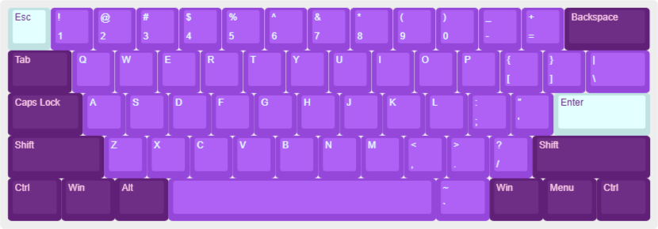
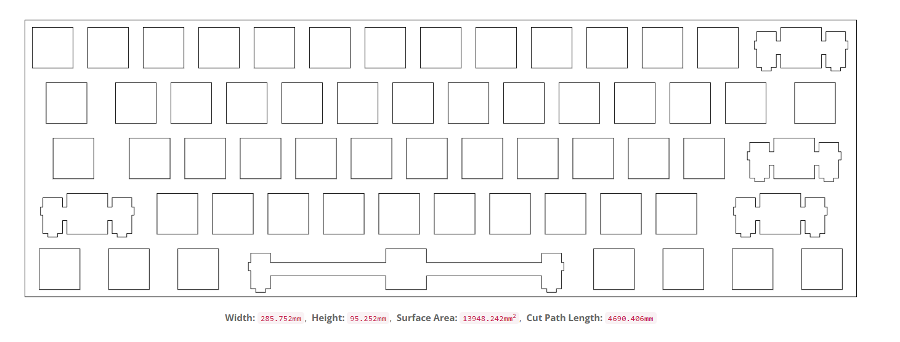
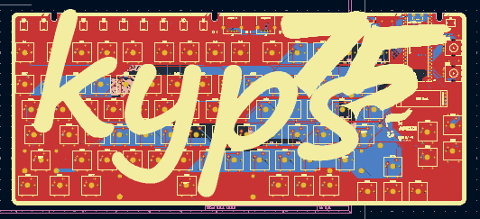
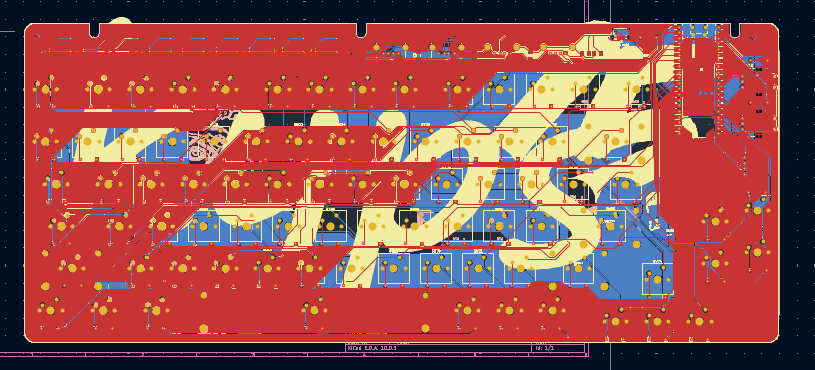
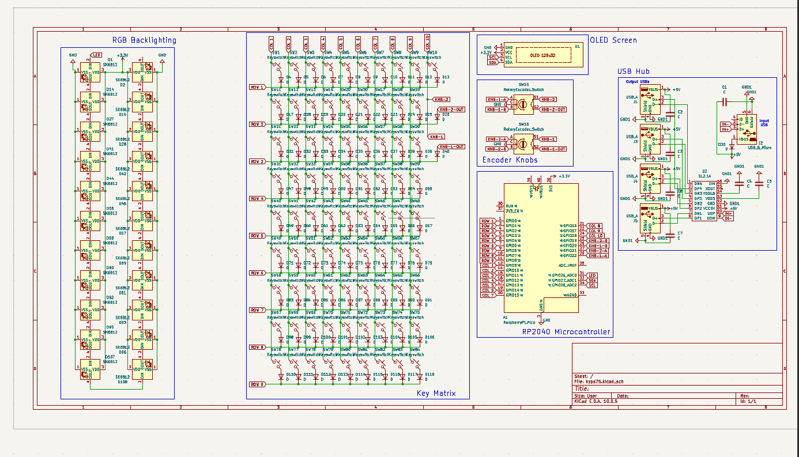
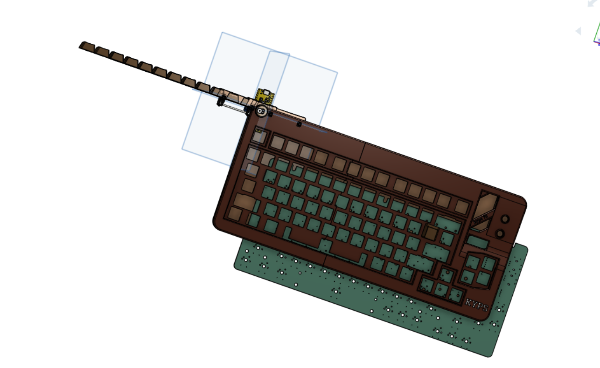
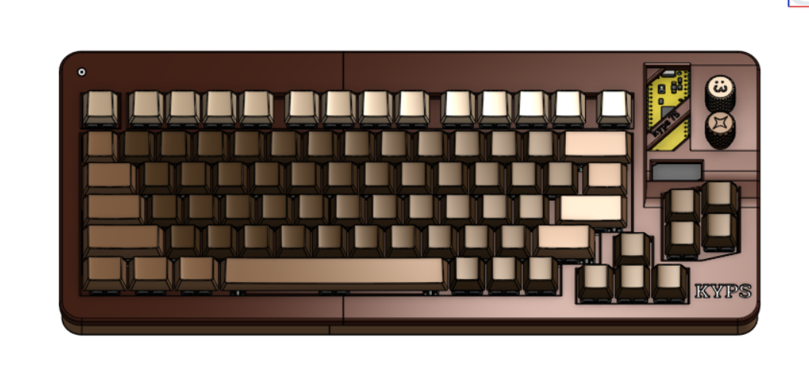

# KYPS75 (because my wallet needed to suffer)

welcome to the KYPS75 repository. this is a scratch-built 75% mechanical keyboard featuring dual rotary encoders and an OLED display [because why have one knob when you can have two?]. i originally designed this after realizing my 60% board was actively sabotaging my daily workflow [turns out arrow keys are actually useful, who knew].

## Features
* 75% exploded layout [so you don't accidentally mash the wrong modifiers while panic-typing]
* dual EC11 rotary encoders [master volume on the left, brush size/timeline scrub on the right]
* 0.91" I2C OLED display [mostly just to show off custom graphics]
* custom 3D-printed enclosure [designed to barely fit the USB-C port]
* QMK/VIA compatible [eventually, whenever i finish fighting the firmware]

## Images of my Build

## Bill of Materials (BOM)

| Component | Description / Spec | Quantity | Estimated Cost ($) |
| :--- | :--- | :--- | :--- |
| Custom PCB | 75% Layout Scratch-Built PCB | 1 | $15.00 |
| 3D Case | Custom Printed Case (PLA) | 1 | $10.00 |
| Mechanical Switches | MX-Style Mechanical Switches | 82 | $18.00 |
| Rotary Encoders | EC11 Rotary Encoders with Push Switch | 2 | $2.50 |
| OLED Display | 0.91" 128x32 I2C OLED Module | 1 | $3.00 |
| Diodes & SMD | 1N4148 Diodes & SMD Resistors/Caps | 1 Set | $3.50 |
| Keycaps | OEM Profile Keycap Set | 1 | $12.00 |
| **Total** | | | **~$54.00** |

## How to Assemble

1. **PCB SMT Component Soldering:** Solder all surface-mount components (diodes, resistors, capacitors, OLED headers, rotary encoder pins, and controller MCU/sockets) onto the custom PCB.
2. **Switch Placement & Soldering:** Push mechanical switches into the top plate and align switch pins with the PCB socket pads. Solder all switch pins and rotary encoders firmly to the board.
3. **Display & Hardware Installation:** Solder the OLED module onto its header pins and mount the rotary encoder knobs onto the D-shafts.
4. **Case Integration:** Insert the switch/PCB assembly into the 3D-printed bottom housing. Secure it using M2/M3 screws through the mounting tabs.
5. **Keycaps & Finishing:** Press the keycaps onto the switch stems, install rubber feet at the bottom of the case, and plug in the USB-C cable for testing.

(For reviewers- yeah! the assembly is partly written by AI because I had no idea what put into it. but take note,only partly not fully) 

## Known Issues

* **Firmware Pending:** Custom firmware layout is still undergoing final keymapping configuration and key matrix debouncing tweaks. [turns out hardware debouncing is a headache]
* **Tight Case Tolerances:** The 3D-printed case fitment around the USB-C cutout is extremely tight and requires slight filing or precise printer calibration. [sandpaper is your friend]
* **Trace Clearance:** Signal lines near the second rotary encoder required tight routing tolerances; ensure clean soldering to avoid bridging.

## Credits

* **Software & Tools:** [KiCad](images/https://www.kicad.org/) (PCB & Schematic design), [Keyboard Layout Editor](images/http://www.keyboard-layout-editor.com/) (Layout concepting), and [SwillKb Plate Builder](images/http://builder.swillkb.com/) (Plate outline generation).
* **Collaborators:** Special thanks to my two friends for assisting with the 3D enclosure modeling and reviewing the electrical layout logic. [i definitely would have shorted the board and started a fire without them]
